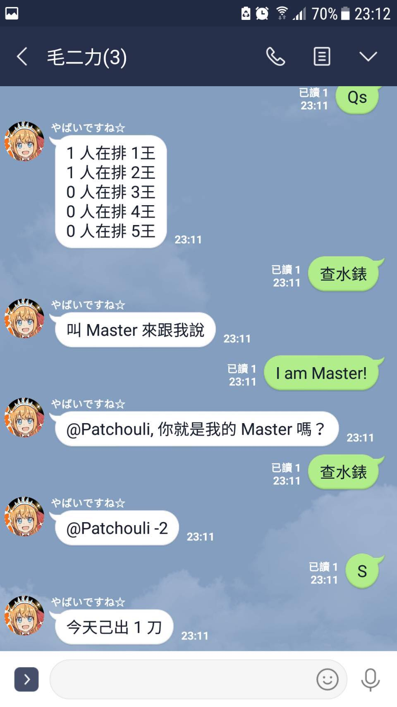

## Init
```sh
npm i
```

## Start
```sh
pm2 start ecosystem.config.js
```

## Notes
```
data:
 - current(Number, enum, {0, 1, 2, 3, 4})
 - finish (Number of 完刀)
 - queue(Array<username[]>, FIFO)
 - watermeter ({} of username:finish)

env:
 - Channel secret
 - user ID

members cmd:
到{x}王/{x}王上線   (change current to x)
排{x}王/報{x}王     (append username to x queue)
棄{x}王            (delete first username from x queue)
完刀    (delete first username from current queue, finish +1)
Q      (return first 5 usernames of current queue)
Qx     (return first 5 usernames of x queue)
Qs     (return queue length of every queue)
S      (return finish)
help   (print manual)

master cmd:
取消 @{username}      (delete first username from current queue)
取消 @{username} {x}王  (delete first username from x queue)
@{username} 完刀      (delete first username from current queue)
@{username} {x}王完刀  (delete first username from x queue)
@{username} 排{x}王     (append username to x queue)
註銷 @{username}      (remove username from watermeter)
查水錶              (return watermeter usernames who's userFinish < 3)

cronjob:
5:00 clear queue & finish & userFinish


doc:
https://line.github.io/line-bot-sdk-nodejs/

libs:
@line/bot-sdk
express
dotenv
ramda
node-schedule
```

## sample

